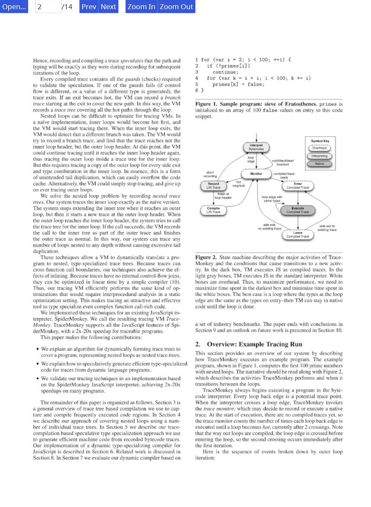

# NiPdf

Nipdf is a PDF file reader and tools written in Rust. It is
still in development, lack some features, but it can view
most PDF files without problem.

## Workspace structure

- `nipdf`: The core library.
- `nipdf-macro`: The macro library for `nipdf` library.
- `nipdf-render`: Render library using `tiny-skia` library.
- `nipdf-dump`: The command line interface tool to extract, dump
  and convert PDF file to png image.
- `nipdf-reader`: The GUI viewer using `iced` gui library.
- `nipdf-viewer`: The GUI viewer using `gtk` gui library.
- `prescript`: Postscript virtual machine, to handle postscript
  function, type1 font, cmap, etc.
- `cff-parser`: CFF font parser.

## Screenshot

## TODO

- [ ] PDF 2.0 support
- [ ] Annotation render
- [ ] Interactive Form
- [ ] Wasm
- [ ] Pure Rust
- [ ] Shadings
    - [ ] Radius shading with two circles
    - [ ] Free-form Gouraud-shaded triangle meshes (Type 4) 
    - [ ] Lattice-form Gouraud-shaded triangle meshes (Type 5) 
    - [ ] Coons patch meshes (Type 6) 
    - [ ] Tensor-product patch meshes (Type 7) 
- [ ] Stable core API

## Pure Rust

Fowling C/C++ lib used because of no equivalent rust crates or has missing
some feature or bug.

1. `zlib`, rust version failed handle some deflate cases
1. `freetype`, `ttf-parser` can not render type1 font, and failed render some `cjk` glyphs
    
